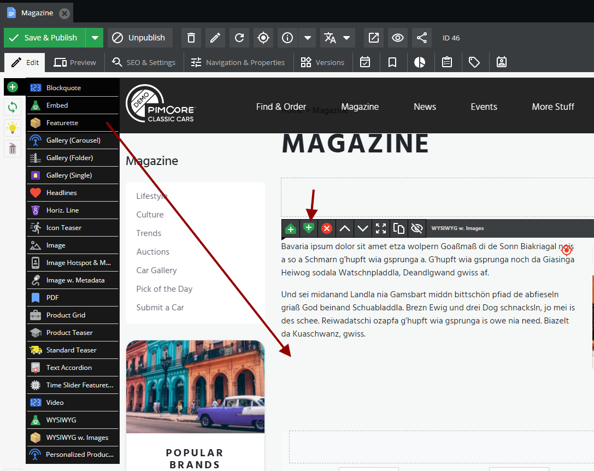
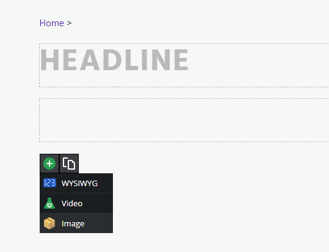

# Areablock Editable

## General 

The areablock is the content construction kit for documents offered by Pimcore.




## Integrate an Areablock in a Template
Similar to the other document editables, an areablock can be integrated in any document view template as follows:

```twig
{{ pimcore_areablock("myAreablock") }}
```

Advanced usage with allowed areas, below:

```twig
{{ pimcore_areablock("myAreablock", {
            "allowed": ["iframe","googletagcloud","spacer","rssreader"],
            "group": {
                "First Group": ["iframe", "spacer"],
                "Second Group": ["rssreader"]
            },
            "globalParams": {
                "myGlobalParam": "Global param value"
            },
            "params": {
                "iframe": {
                    "parameter1": "value1",
                    "parameter2": "value2"
                },
                "googletagcloud": {
                    "param1": "value1"
                }
            }
        })
    }}
```

##### Accessing Parameters from the Brick File
Use the value of parameter named "param1" for this brick: 
```twig
{{ param1 }}
```

##### Sorting Items in the menu
```twig
{{ pimcore_areablock("content", {
    "allowed": ["image","video","wysiwyg"],
    "sorting": ["wysiwyg","video","image"],
}) }}
```

And you can see the effect, below:



## Configuration

| Name                | Type   | Description                                                                                                                                                                                  |
|---------------------|--------|----------------------------------------------------------------------------------------------------------------------------------------------------------------------------------------------|
| `allowed`           | array  | An array of area-ID's which are allowed for this tag. The order of items in the array is also used as the default sorting, but of course you can combine this configuration with **sorting** |
| `sorting`           | array  | An array of area-ID's in the order you want to display them in the menu.                                                                                                                  |
| `params`            | array  | Optional parameter, this can also contain additional brick-specific configurations, see **brick-specific configuration**                                                                     |
| `globalParams`      | array  | Same as `params` but passed to all bricks independent from the type                                                                                                                          |
| `group`             | array  | Array with group configuration (see example above).                                                                                                                                          |
| `manual`            | bool   | Forces the manual mode, which enables a complete free implementation for areablocks, for example using real `<table>` elements... example see below                                          |
| `reload`            | bool   | Set to `true`, to force a reload in editmode after reordering items (default: `false`)                                                                                                       |
| `limit`             | int    | Limit the amount of elements                                                                                                                                                                 |
| `limits`            | array  | An array of area-ID's with count to limit the amount of certain elements e.g. \{"iframe": 1, "teasers": 2\}                                                                     |
| `areablock_toolbar` | array  | Array with option that allows you to configure the toolbar. Possible options are `width`, `buttonWidth` and `buttonMaxCharacters`                                                            |
| `controlsAlign`     | string | The position of the control button bar. Options are: `top`, `right` and `left`.                                                                                                              |
| `controlsTrigger`   | string | Options are: `hover`(default) and `fixed` .                                                                                                              |
| `class`             | string | A CSS class that is added to the surrounding container of this element in editmode                                                                                                           |

##### Example

```twig
{{ pimcore_areablock("myArea") }}
```

## Methods

| Name                | Return    | Description                                                                            |
|---------------------|-----------|----------------------------------------------------------------------------------------|
| `getCount()`        | int       | Total count of blocks                                                                  |
| `getCurrent()`      | int       | Current number of block (useful with area bricks)                                      |
| `getCurrentIndex()` | int       | Get the current index (index is different from position, as you can move block around) |
| `getElement()`      | array     | Get an element out of an areabrick                                                     |
| `renderIndex()`     | -         | Renders only one specific block within the areablock                                   |

## How to Create Bricks for the Areablock

You can read about **bricks** in the [Bricks](./02_Bricks.md) section.

## Limit certain Bricks for the Areablock

You can limit certain bricks for the Areablock by using `limits` configurations.
##### Example

```twig
{{ pimcore_areablock("myAreablock", {
        "allowed": ["iframe","teasers","wysiwyg"],
        "limits": {
            "iframe": 1,
            "teasers": 2
        },
        "limit": 5
    })
}}
```

## Using Manual Mode

The manual mode offers you the possibility to use areablocks with custom HTML, this is for example useful when using tables: 

```twig



<table>
    
        
        
            <tr>
                <td>
                    
                    
                    
                </td>
            </tr>
        
    
</table>

```

### Accessing Data within an Areablock Element

See [Block](../06_Block.md) for an example how to get elements from block and areablock editables.
