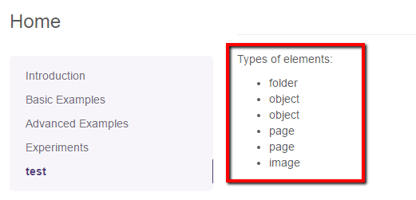

# Relations (Many-To-Many) Editable

## General
The relations editable provides many to many relation to other Pimcore elements (document, asset, object). 


## Configuration 

| Name                  | Type      | Description                                                                                                                                                     |
|-----------------------|-----------|-----------------------------------------------------------------------------------------------------------------------------------------------------------------|
| `width`               | integer   | Width for the widget in pixels (optional)                                                                                                                       |
| `height`              | integer   | Height for the widget in pixels (optional)                                                                                                                      |
| `title`               | string    | Title for the input-widget                                                                                                                                      |
| `uploadPath`          | string    | Target path for (inline) uploaded assets                                                                                                                        |
| `disableInlineUpload` | boolean   | Disable the inline upload for assets. If set to true, the inline upload functionality will be disabled.                                                         |
| `types`               | array     | Allowed types (document, asset, object), if empty all types are allowed                                                                                         |
| `subtypes`            | array     | Allowed subtypes grouped by type (folder, page, snippet, image, video, object, ...), if empty all subtypes are allowed (see example below)                      |
| `classes`             | array     | Allowed object class names, if empty all classes are allowed                                                                                                    |
| `class`               | string    | A CSS class that is added to the surrounding container of this element in editmode   
| `reload`     | boolean | `true` triggers page reload on each change    |

## Methods

| Name            | Return   | Description                          |
|-----------------|----------|--------------------------------------|
| `getElements()` | array    | Array of the assigned elements       |
| `current()`     | int      | Get the current index while looping  |
| `isEmpty()`     | boolean  | Whether the editable is empty or not |


## Example

### Basic Usage

The code below is responsible for showing a list of elements types related to the relations editable. 

```twig
<p>{{ "Types of elements" | trans }}:</p>

    {{ pimcore_relations("objectPaths") }}

<ul>
    
        <li>{{ element.getType() }}</li>
    
</ul>

```


Picture below, presents the editmode preview:


The frontend part looks like that:



To better understand what exactly is the `$element` variable, have a look at the output below:

```
array(6) {
  [0] => string(27) "Pimcore\Model\DataObject\Folder"
  [1] => string(32) "Pimcore\Model\DataObject\BlogArticle"
  [2] => string(32) "Pimcore\Model\DataObject\BlogArticle"
  [3] => string(27) "Pimcore\Model\Document\Page"
  [4] => string(27) "Pimcore\Model\Document\Page"
  [5] => string(25) "Pimcore\Model\Asset\Image"
}
```

### Example with allowed types and subtypes
Similar to the single relation editable, this editable also could specify allowed `types`, `subtypes` and `classes`. 
For example:

```twig
{{ pimcore_relations("objectPaths", {
    "types": ["asset","object"],
    "subtypes": {
        "asset": ["video","image"],
        "object": ["object"]
    },
    "classes": ["person"]
}) }}
```

Now, a user is not able to add other elements than specified in the types configuration part.
