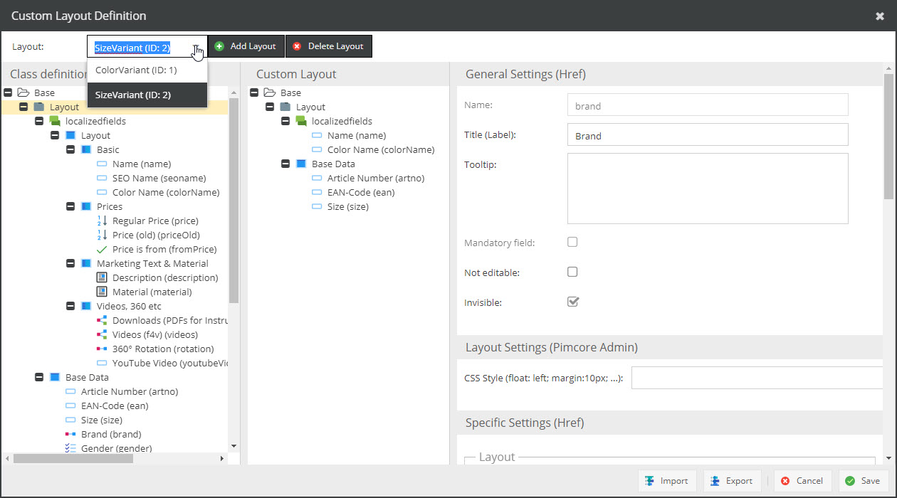

# Showing Custom Layouts based on Object Data

The event [`OBJECT_GET_PRE_SEND_DATA`](https://github.com/pimcore/admin-ui-classic-bundle/blob/1.x/src/Event/AdminEvents.php#L328-L340)
can be used to manipulate the server response before object data is sent to Pimcore Backend UI when opening the detail
view of an Pimcore object. 

**Imagine following use case:** 
Products (stored as Pimcore objects) are organized in a certain hierarchy and take advantage of Pimcores data 
inheritance. An example would be the structure we use in our e-commerce demo application where we have three levels
of product hierarchy: article, color variant, size variant.
To minimize maintenance effort, certain attributes should only be maintained on a certain hierarchy level (e.g. product
name on article level, color and images on color variant level, size on size variant level).
 
In order to make this simple for the editors, they only should see the attributes they need to maintain on the corresponding
hierarchy level. 


**Solution**

1) Create a [Custom Layout](../05_Objects/01_Object_Classes/05_Class_Settings/15_Custom_Layouts.md) 
for every hierarchy level. 


 
2) Use the `OBJECT_GET_PRE_SEND_DATA` event to decide which custom layouts should be shown to the user based the hierarchy level. 
To do so create a [Event Listener](../20_Extending_Pimcore/11_Event_API_and_Event_Manager.md) 
with following content: 


`config/services.yaml`
```yml
services:
    app.event_listener.my_event_listner:
        class: App\EventListener\MyEventListener
        tags:
            - { name: kernel.event_listener, event: pimcore.admin.dataobject.get.preSendData, method: selectCustomLayout }
```

`src/EventListener/MyEventListener`

```php
<?php
namespace App\EventListener;

use ... 

class MyEventListener
{
    public function selectCustomLayout(GenericEvent $event): void
    {
        $object = $event->getArgument('object');
        if ($object instanceof Product) {
            //get product hierarchy level
            $hierarchyLevel = $object->getLevel(); 

            //data element that is send to Pimcore backend UI
            $data = $event->getArgument('data');

            switch ($hierarchyLevel) {
                case 'Article':
                    $data = $this->doModifyCustomLayouts($data, $object, 2, [0, 1]);
                    break;
                case 'Color Variant':
                    $data = $this->doModifyCustomLayouts($data, $object, 1, [0, 2]);
                    break;
                default:
                    $data = $this->doModifyCustomLayouts($data, $object, 0, [1, 2]);
                    break;
            }
            
            $event->setArgument('data', $data);
        }
    }

    private function doModifyCustomLayouts(array $data, Product $object, int $customLayoutToSelect, array $layoutsToRemove): array
    {
        //set current layout to subcategory layout
        $data['currentLayoutId'] = $customLayoutToSelect;
        $customLayout = CustomLayout::getById($customLayoutToSelect);
        $data['layout'] = $customLayout->getLayoutDefinitions();
        Service::enrichLayoutDefinition($data['layout'], $object);
        
        if (!empty($layoutsToRemove)) {
            //remove main layout from valid layouts
            $validLayouts = $data['validLayouts'];
            foreach($validLayouts as $key => $validLayout) {
                if(in_array($validLayout['id'], $layoutsToRemove)) {
                    unset($validLayouts[$key]);
                }
            }
            $data['validLayouts'] = array_values($validLayouts);            
        }

        return $data; 
    }
}


```
