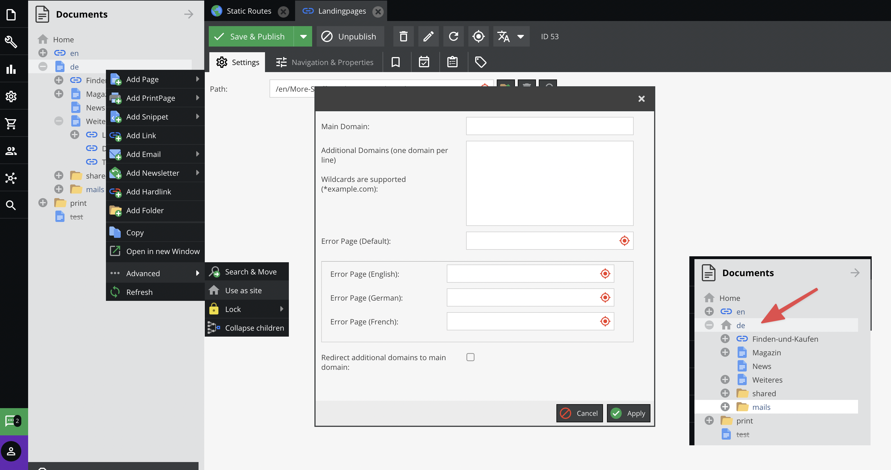

# Working with Sites

## Introduction
With Sites, it is possible to create multi domain web applications within Pimcore. 
 Starting point is always a certain node in the Documents tree. From this starting point on, the whole sub tree can appear
 as an own Site and is reachable with a certain domain.  

## Configuring Sites
You can create subsites in Pimcore very easily directly in the context menu of the Document tree: 



That's basically all.
 
 Note: Of course, your server setup (VHost, `ServerAlias`) must be configured properly so that all the requests for all the 
 domains are delegated to Pimcore. 
 
 
Now also the routing functionalities [Custom Routes](./02_Custom_Routes.md) and [Redirects](./04_Redirects.md) 
can be configured site specific. 
Also, lots of other Pimcore tools and functionalities like Glossary, Tag & Snippet Management, Marketing Settings 
(Google Analytics, Google Search Console, Google Tag Manager) and Website Settings are site specific. 


## Sites in your Code

#### Check if Current Request is Inside a Subsite

<div class="code-section">

```php
if(\Pimcore\Model\Site::isSiteRequest()) { /* ... */ }
```

```twig

    {# ... #}

```

</div>

#### Working with the Navigation Helper
See [Navigation](../../03_Documents/03_Navigation.md) for more information. 


#### Getting the full path of a document inside a subsite-request

<div class="code-section">

```php
$document->getRealFullpath(); // returns the path including the site-root
$document->getFullPath(); // returns the path relative to the site-root
```

```twig
document.getRealFullpath()   {# returns the path including the site-root #}
document->getFullPath()  {# returns the path relative to the site-root #}
```
</div>

#### Getting the root-document of the current site

<div class="code-section">

```php
if (\Pimcore\Model\Site::isSiteRequest()) {
    $site = \Pimcore\Model\Site::getCurrentSite();
    $navStartNode = $site->getRootDocument();
} else {
    $navStartNode = \Pimcore\Model\Document::getById(1);
}
```

```twig
    
        
        
    
        
    
```

</div>

#### Some other Tools
The functionality should be pretty self-explanatory: 
```php
\Pimcore\Tool\Frontend::getSiteForDocument($document);
\Pimcore\Tool\Frontend::isDocumentInCurrentSite($document);
\Pimcore\Tool\Frontend::isDocumentInSite($site, $document);
```

#### Document Preview Navigation with Sites
Please keep in mind that when previewing documents that have links to different Sites, the navigation may not be working properly due the Iframe Content Security Policies and Cross-origin resource sharing (CORS) policy, please set your own security rules accordingly to your own needs.
