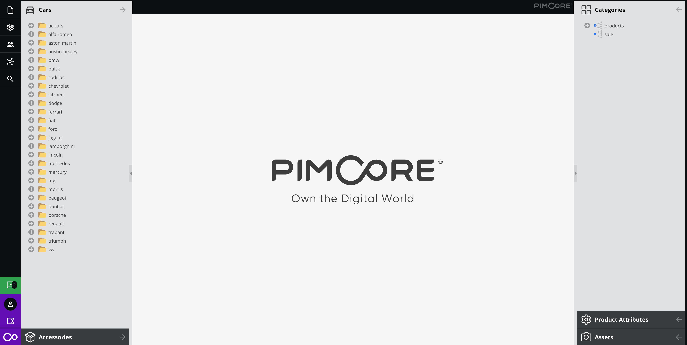

# Custom Views
A custom view is an additional custom tree representing a subset of elements of the corresponding original tree.
Custom views can be configured for Documents, Assets and Objects. 

To create or edit perspectives and custom views within the Pimcore backend UI use the [perspective editor](https://github.com/pimcore/perspective-editor) bundle.

> **Security Note**    
> Perspectives and Custom Views are not intended to be used to restrict access to data

An unlimited number of custom views can be created. Specify the tree type, root node and layout settings. 
Note that the ID is mandatory and must be unique!



For a sample configuration file have a look at the [sample configuration](21_Custom_View_Example.md).

## Advanced Features / Configurations

#### Additional object tree including condition filter
The main idea for this configuration is to
* add an additional object tree called `Events` having its root at `/Events`
* not showing the parent folder as its root
* only show events that have the "Salzburg" tag.

> **Note**
> Be aware: for tree pagination to work properly, there needs to be a parent node available. 
> If you have more than a certain amount of child nodes at your root level, you might need to set "showroot" to true because of that.  

```yaml
#var/config/custom-views/customviews.yaml

pimcore:
    custom_views:
        definitions:
            87705013-edb9-c9ec-0f5e-c3ee45ca4459:
                name: Events
                treetype: object
                position: right
                rootfolder: /Events
                showroot: false
                sort: 0
                treeContextMenu:
                    object:
                        items:
                            add: true
                            addFolder: true
                            importCsv: true
                            cut: true
                            copy: true
                            paste: true
                            delete: true
                            rename: true
                            reload: true
                            publish: true
                            unpublish: true
                            searchAndMove: true
                            lock: true
                            unlock: true
                            lockAndPropagate: true
                            unlockAndPropagate: true
                            changeChildrenSortBy: true
                classes: ''
                joins: [
                    {
                        type: left,
                        name: { ev: object_query_EV },
                        condition: 'objects.id = ev.oo_id',
                        columns: { ev: tags }
                    }
                ]
                id: 87705013-edb9-c9ec-0f5e-c3ee45ca4459
                icon: /bundles/pimcoreadmin/img/flat-color-icons/vip.svg
                where: ''
                having: 'ev.tags LIKE "%%Salzburg%%"'
```


#### Additional asset tree hiding items based on a property
* use the `/examples/panama` as the root folder
* do not show the parent node
* position it on the left
* place it on the top and expand it
* hide assets which have the "HIDE" property set to true

```yaml
#var/config/custom-views/customviews.yaml

pimcore:
    custom_views:
        definitions:
            186632eb-5ad3-6ac6-61f8-7a75e64f2204:
                name: 'Panama Impressions'
                treetype: asset
                position: left
                rootfolder: /examples/panama
                showroot: false
                sort: -4
                treeContextMenu:
                    asset:
                        items:
                            add:
                                hidden: false
                                items:
                                    upload: true
                                    uploadCompatibility: true
                                    uploadZip: true
                                    importFromServer: true
                                    uploadFromUrl: true
                            addFolder: true
                            rename: true
                            copy: true
                            cut: true
                            paste: true
                            pasteCut: true
                            delete: true
                            searchAndMove: true
                            lock: true
                            unlock: true
                            lockAndPropagate: true
                            unlockAndPropagate: true
                            reload: true
                joins: [
                    {
                        type: left,
                        name: { meta: properties },
                        condition: "(meta.cid = assets.id AND meta.ctype = 'asset' AND name = 'HIDE')",
                        columns: { hide: data }
                    }
                ]
                icon: /bundles/pimcoreadmin/img/flat-color-icons/camera_identification.svg
                where: ''
                having: 'type = "folder" OR hide is NULL or hide != 1'
```


#### Document tree filtering using the where clause
The intention is to
* show the `/en/Magazine` (including the parent node on the right side)
* apply a simple filter which allows us to only show
   * folders 
   * links
   * pages which do not have the character 'g' in their key

```yaml
#var/config/custom-views/customviews.yaml

pimcore:
    custom_views:
        definitions:
            c3da6659-c8b3-f3ed-2eda-70b2d3756730:
                name: Magazine
                treetype: document
                position: right
                rootfolder: /en/Magazine
                showroot: true
                sort: -12
                treeContextMenu:
                    document:
                        items:
                            add: true
                            addSnippet: true
                            addLink: true
                            addEmail: true
                            addNewsletter: true
                            addHardlink: true
                            addFolder: true
                            addPrintPage: true
                            paste: true
                            pasteCut: true
                            copy: true
                            cut: true
                            rename: true
                            unpublish: true
                            publish: true
                            delete: true
                            open: true
                            convert: true
                            searchAndMove: true
                            useAsSite: true
                            editSite: true
                            removeSite: true
                            lock: true
                            unlock: true
                            lockAndPropagate: true
                            unlockAndPropagate: true
                            reload: true
                icon: /bundles/pimcoreadmin/img/flat-color-icons/reading.svg
                where: "(type = 'folder' OR (type = 'page' and `key` NOT LIKE '%%g%%' OR type = 'link'))"

``` 
   
   


## Customizing the Tree Context Menu

Allows you to hide certain context menu items via the customview's treeContextMenu configuration option.

```yaml
#var/config/custom-views/customviews.yaml

pimcore:
    custom_views:
        definitions:
            186632eb-5ad3-6ac6-61f8-7a75e64f2204:
                ...
                treeContextMenu:
                    asset:
                        items:
                            add:
                                hidden: false
                                items:
                                    upload: true
                                    uploadCompatibility: true
                                    uploadZip: true
                                    importFromServer: false     #deny importFromServer
                                    uploadFromUrl: true
                            addFolder: false
                            rename: true
                            copy: false                         #deny copy
                            cut: false                          #deny cut
                            paste: true
                            pasteCut: true
                            delete: true
                            searchAndMove: true
                            lock: false                         #deny lock
                            unlock: true
                            lockAndPropagate: true
                            unlockAndPropagate: true
                            reload: true
                ...
```


There are keys for most of the menu items, including sub menu items. The notion is like indicated in the example configuration.

Let's assume that we want to hide the "copy" option. The short way is this one:

```yaml
copy: false #the default is that all menu entries are visible    
```

```yaml
copy: 
    hidden: true
```

