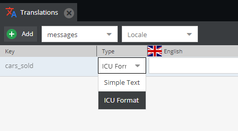
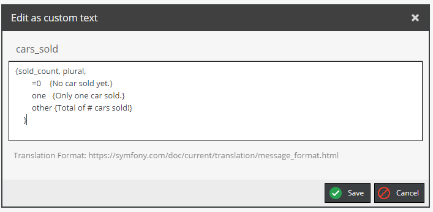

# Shared Translations 

Pimcore provides an easy way for editors to edit commonly used translation terms across the application, which can be found 
here:  `Extras` > `Translation` > `Shared Translations`.
In the background the standard Symfony Translator component is used to add the shared translation functionality to the application. 
The main benefit is that you have only one single translator for all your translations. 

It automatically uses the locale specified on a document or from a fallback mechanism. 

For more information, please also check out [Symfony's Translations Component](https://symfony.com/doc/5.2/translation.html). 


Available languages are defined within the system languages, see [here](./README.md).

Shared translations are stored in `translations_messages` database table and can be versioned using [Migrations](https://pimcore.com/docs/pimcore/current/Development_Documentation/Development_Tools_and_Details/Migrations.html)
## Translations case sensitivity

Translations are case sensitive by default. You can
reconfigure Pimcore to handle website and admin translations as case insensitive, however as this implies a performance
hit (translations might be looked up twice) and it does not  conform with Symfony's translators you're encouraged to reference
translation keys with the same casing as they were saved.

## Working with Shared Translations / the Translator in Code
  
#### Example in Templates / Views

You can also use variable interpolation in localized messages.

```twig
<div>
    <address>&copy; {{ 'Copyright'|trans }}</address>
    <a href="/imprint">{{ 'Imprint'|trans }}</a>
    {# variable interpolation, 'about' translates to 'About {{siteName}}' #}
    <a href="/about">{{ 'about'|trans({'{{siteName}}': siteName}) }}</a>
</div>
```

Parameters in translations can be wrapped in double curly braces (`{{` and `}}`) but you are free to use other placeholder wrappers as well, e.g. `%parameter%` like in the [Symfony docs](https://symfony.com/doc/5.2/translation.html#translatable-objects) also works.

#### Example in a Controller
 
```php
<?php

namespace App\Controller;

use Symfony\Contracts\Translation\TranslatorInterface;
use Pimcore\Controller\FrontendController;

class ContentController extends FrontendController
{
    public function defaultAction(TranslatorInterface $translator)
    {
        $translatedLegalNotice = $translator->trans("legal_notice");
        $siteName = "Demo"; // or get dynamically
        // variable interpolation, 'about' translates to 'About {{siteName}}'
        $translatedAbout = $translator->trans("about", ['siteName' => $siteName]);
    }
}
```

#### Translation Pluralization/Selection
Since Pimcore uses Symfony Translator component in background, you can store and use the translations in ICU Message Format(supported by Symfony Translator) for Pluralization, Selection and more. [Read here](https://symfony.com/doc/5.2/translation/message_format.html)
This can be achieved in Pimcore by selecting type "custom" on translation UI and passing required parameter in view/Controller. 
e.g.
 - Add translation key and select type "custom".

    
    
 - Click on language cell to edit and add translation in ICU format `{variable_name, function_name, function_statement}`.

    

 - Use in view
```twig
    {{ 'cars_sold'|trans({'sold_count': 0}) }}
    {# output: No car sold yet. #}
   
    {{ 'cars_sold'|trans({'sold_count': 1}) }}
    {# output: Only one car sold. #}
   
    {{ 'cars_sold'|trans({'sold_count': 100}) }}
    {# output: Total of 100 cars sold! #}
```

## Pimcore backend functionalities

### Sorting & Filtering on language level


### Translation Export & Import

Translations can be exported to a CSV file and then re-imported later on.


Translations are still imported automatically as long as the translation key does not exist in the target system or the 
translation itself is still empty. Conflicts (i.e. the translation in the target system does not match the version of 
the source) are shown in an overview tab and then can be merged manually.


