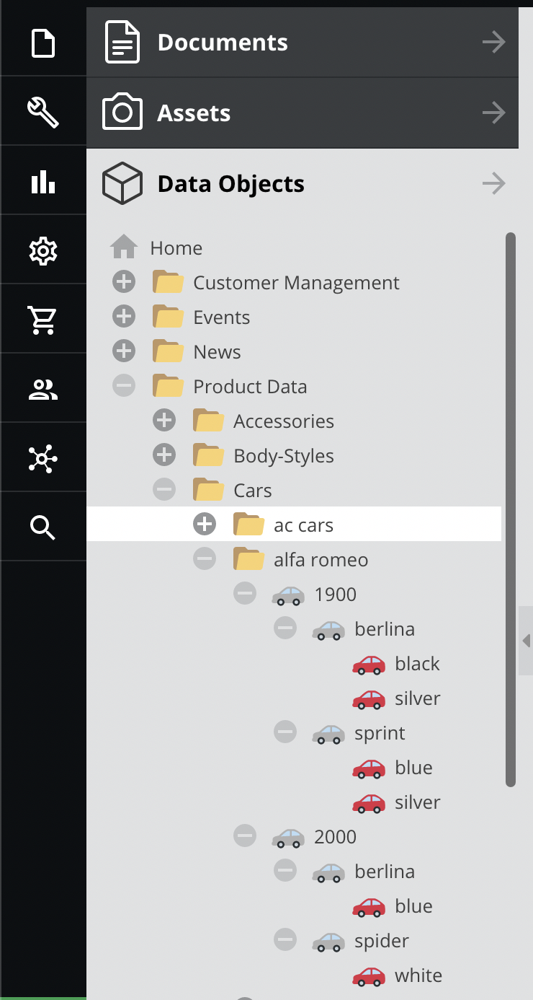
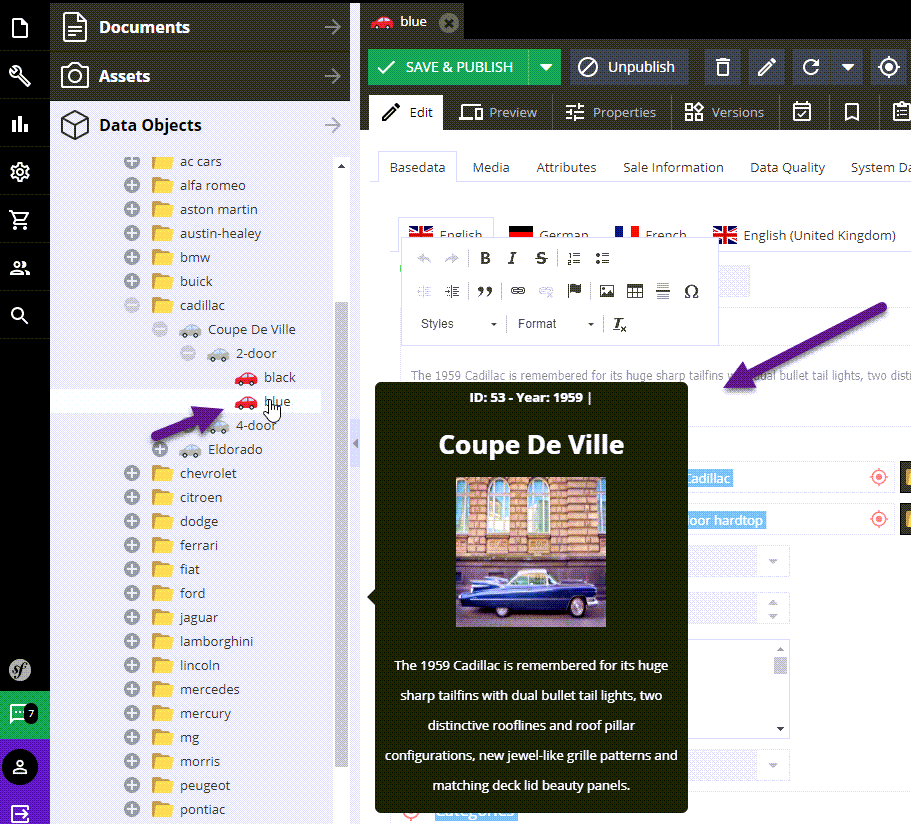
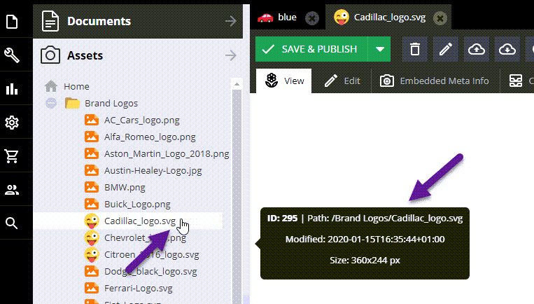

# Custom Icons & Tooltips for Documents/Assets & Data Objects

Pimcore allows to dynamically define custom element icons & tooltips in the element tree. In addition, the icon of the editor tab can
be changed.

#### Properties that can be changed
* Element CSS class
* Element icon
* Element icon class
* Tree node tooltip

## How to override the default style
 
The basic idea is to provide one's own implementation of `Pimcore\Model\Element\AdminStyle`.
 
This can be achieved by attaching a listener to the [`AdminEvents::RESOLVE_ELEMENT_ADMIN_STYLE`](https://github.com/pimcore/pimcore/blob/11.x/lib/Event/AdminEvents.php#L396-L407) event. 

Example:

In `config/services.yaml` add

```yaml
  App\EventListener\AdminStyleListener:
    tags:
      - { name: kernel.event_listener, event: pimcore.admin.resolve.elementAdminStyle, method: onResolveElementAdminStyle }
```

Create AdminStyleListener in EventListeners

```php
<?php

namespace App\EventListener;

class AdminStyleListener
{
    public function onResolveElementAdminStyle(\Pimcore\Event\Admin\ElementAdminStyleEvent $event)
    {
        $element = $event->getElement();
        // decide which default styles you want to override
        if ($element instanceof \App\Model\Product\Car) {
            $event->setAdminStyle(new \App\Model\Product\AdminStyle\Car($element));
        }
    }
}

```

 
### Example: Custom Icon for the Car DataObject

This will change the `Car` icon depending on the car type:

```php
namespace App\Model\Product\AdminStyle;

use App\Website\Tool\ForceInheritance;
use Pimcore\Model\Element\AdminStyle;

class Car extends AdminStyle
{
    /** @var ElementInterface */
    protected $element;

    public function __construct($element)
    {
        parent::__construct($element);

        $this->element = $element;

        if ($element instanceof \App\Model\Product\Car) {
            ForceInheritance::run(function () use ($element) {
                if ($element->getObjectType() == 'actual-car') {
                    $this->elementIcon = '/bundles/pimcoreadmin/img/twemoji/1f697.svg';
                }
            });
        }
    }
}
```

Result:




## Example: Custom Tooltips

It is possible to define custom tooltips which are shown while hovering over the element tree.

The example outlines how to provide a custom tooltip for `Car` objects.

```php
    /**
     * {@inheritdoc}
     */
    public function getElementQtipConfig(): ?array
    {
        if ($this->element instanceof \App\Model\Product\Car) {
            $element = $this->element;

            return ForceInheritance::run(function () use ($element) {
                $text = '<h1>' . $element->getName() . '</h1>';

                $mainImage = $element->getMainImage();
                if ($mainImage) {
                    $thumbnail = $mainImage->getThumbnail("content");
                    $text .= '<p></p>';
                }

                $text .= wordwrap($this->element->getDescription(), 50, "<br>");

                return [
                    "title" => "ID: " . $element->getId() . " - Year: " . $element->getProductionYear(),
                    "text" => $text,
                ];
            });
        }

        return parent::getElementQtipConfig();
    }
```

Result:



#### Example: Custom Style for Assets

This will display the modification date and image size as additional information. Besides that, it shows
a different icon for all assets starting with a capital 'C' in their key. 

```php
namespace App\Model\Product\AdminStyle;

use Pimcore\Model\Asset;
use Pimcore\Model\Element\AdminStyle;

class AssetEventStyle extends AdminStyle
{
    public function __construct($element)
    {
        parent::__construct($element);

        if ($element instanceof Asset\Image) {
            if (strpos($element->getKey(), 'C') === 0) {
                $this->elementIconClass = null;
                $this->elementIcon = '/bundles/pimcoreadmin/img/twemoji/1f61c.svg';
            }

            $this->elementQtipConfig = [
                'title' => 'ID: ' . $element->getId(),
                'text' => 'Path: ' . $element->getFullPath()
                        . '<br>Modified: ' . date('c', $element->getModificationDate())
                        . '<br>Size:  '. $element->getWidth() . 'x' . $element->getHeight() . " px"
            ];
        }
    }
}
```


