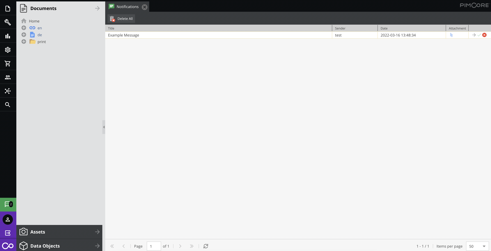
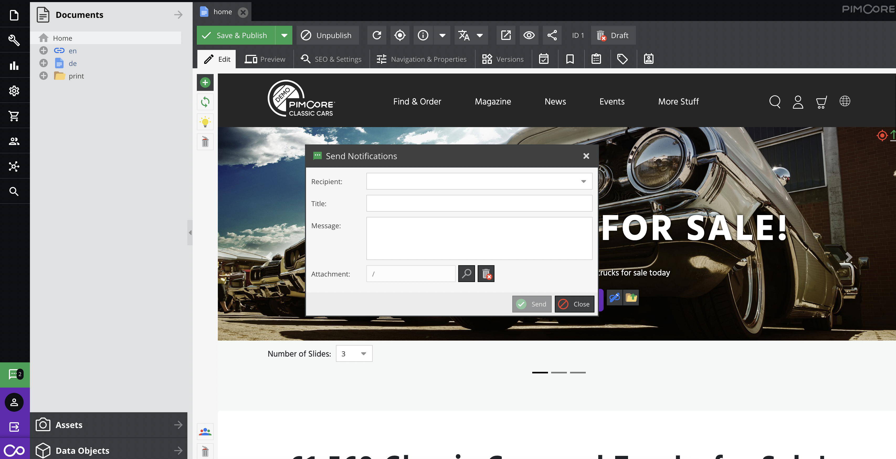

# Notifications

Feature allows to send notifications to user. `Notifications` adds to status bar new clickable icon, on click it opens new tab with all notifications, also it contains badge with unread notifications count.

When there's new notification for user, it shows as window with possibility to close it, mark as read or open details.



User can use `Share via Notifications` button in order to open a new notification window and pre-fill the attachment field with desired element.



## Working with Notifications via API

### Overview 

For accessing and working with tags via API, take a look into `Pimcore\Model\Notification\Service\NotificationService`.
```php
<?php
 /**
     * @param int $id
     * @return Notification
     * @throws \UnexpectedValueException
     */
    public function find(int $id): Notification
    {
        $notification = Notification::getById($id);

        if (!$notification instanceof Notification) {
            throw new \UnexpectedValueException("Notification with the ID {$id} doesn't exists");
        }

        return $notification;
    }
    
    /**
     * @param array $filter
     * @param array $options
     * @return array
     */
    public function findAll(array $filter = [], array $options = []): array
    {
        $listing = new Listing();

        if (!empty($filter)) {
            $condition          = implode(' AND ', array_keys($filter));
            $conditionVariables = array_values($filter);
            $listing->setCondition($condition, $conditionVariables);
        }

        $listing->setOrderKey('creationDate');
        $listing->setOrder('DESC');
        $offset = (int) $options['offset'] ?? 0;
        $limit  = (int) $options['limit'] ?? 0;

        $this->beginTransaction();

        $result = [
            'total' => $listing->count(),
            'data' => $listing->getItems($offset, $limit)
        ];

        $this->commit();

        return $result;
    }
```

If you want to send some notifications to user:
```php
<?php

use Pimcore\Model\Notification\Service\NotificationService;

public function defaultAction(
    Request $request,
    NotificationService $notificationService
) {
    $element = Asset::getById(1); // Optional
    
    $notificationService->sendToUser(
        4, // User recipient
        2, // User sender 0 - system
        'Example notification',
        'Example message', 
        $element // Optional linked element
    );
}
```

If you want to send some notifications to users from group:
```php
<?php

use Pimcore\Model\Notification\Service\NotificationService;

public function defaultAction(
    Request $request,
    NotificationService $notificationService
) {
    $element = Asset::getById(1); // Optional
    
    $notificationService->sendToGroup(
        4, // Group recipient
        2, // User sender 0 - system
        'Example notification',
        'Example message', 
        $element // Optional linked element
    );
}
```

### Configuration

The configuration allows enabling/disabling the *Notifications menu* in the toolbar
and the *check of new notifications* (url: `/admin/notification/find-last-unread`).
It is done in the `pimcore_admin` configuration in the `notifications` section.

default:
```yaml
pimcore_admin:
    notifications:
        enabled: true
        check_new_notification:
            enabled: true
            interval: 30
```

#### Example configurations:

* Disable notifications menu and check of new unread notifications:
```yaml
pimcore_admin:
    notifications:
        enabled: false
```

* Disable only the check of new unread notifications:
```yaml
pimcore_admin:
    notifications:
        check_new_notification:
            enabled: false
```

* Change interval to get new unread notifications:
```yaml
pimcore_admin:
    notifications:
        check_new_notification:
            interval: 60
```