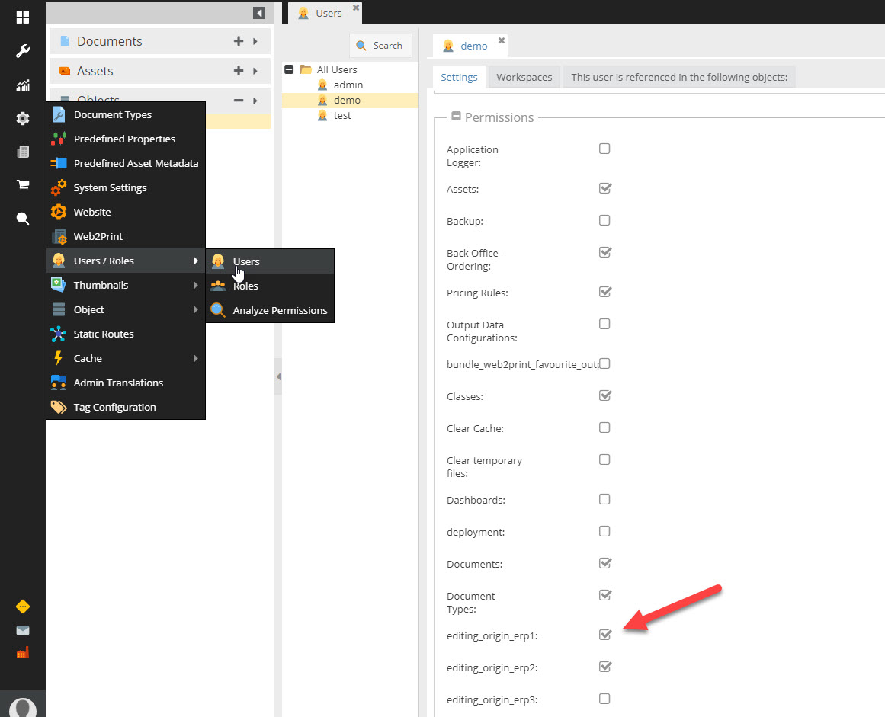

# Modifying Permissions based on Object Data

The event [`OBJECT_GET_PRE_SEND_DATA`](https://github.com/pimcore/pimcore/blob/master/lib/Event/AdminEvents.php#L292-L304)
can be used to manipulate the server response before object data is sent to Pimcore Backend UI when opening the detail
view of an Pimcore object. 

**Imagine following use case:** 
Your PIM system aggregates different sources (e.g. multiple ERP systems from different sub companies) of products and merges
them to one single product hierarchy tree in order to have one single tree of products. 
So all editors can see all products in one place and get a good overview of all available products, which is great.  

When it comes to editing though, not all editors should be able to edit all products. The editing permissions for products 
should be based on the ERP system they originate from.
Since the products are merged together into one tree structure, setting up such a permission structure might become ticky, 
especially when products are moved around in the object tree. 


**Solution**

1) Define additional permissions by adding additional entries into the table `users_permission_definitions`. These permission
entries are visible and can be configured in users and roles permission settings. 


 
2) Use the `OBJECT_GET_PRE_SEND_DATA` event to modify user permissions on the fly based on object data (e.g. objects origin) 
when opening the object. 
To do so create a [Event Listener](../20_Extending_Pimcore/11_Event_API_and_Event_Manager.md) 
with following content: 


`app/config/services.yml`
```yml
services:
    app.event_listener.my_event_listner:
        class: App\EventListener\MyEventListener
        arguments:
            - '@pimcore_admin.security.user_loader'
        tags:
            - { name: kernel.event_listener, event: pimcore.admin.object.get.preSendData, method: checkPermissions }
```

`src/EventListener/MyEventListener`

```php
<?php
namespace App\EventListener;

use ... 

class MyEventListener {

    /**
     * @var UserLoader
     */
    protected $userLoader;

    public function __construct(UserLoader $userLoader)
    {
        $this->userLoader = $userLoader;
    }


    public function checkPermissions(GenericEvent $event) {

        $object = $event->getArgument("object");
        if($object instanceof Product) {

            //data element that is send to Pimcore backend UI
            $data = $event->getArgument("data");

            //get product origin
            $origin = 'erp1';

            //get current user
            $user = $this->userLoader->getUser();

            //check if allowed and if not change permission
            if(!$user || !$user->isAllowed("editing_origin_$origin")) {

                $data['userPermissions']['save'] = false;
                $data['userPermissions']['publish'] = false;
                $data['userPermissions']['unpublish'] = false;
                $data['userPermissions']['delete'] = false;
                $data['userPermissions']['create'] = false;
                $data['userPermissions']['rename'] = false;

            }

            $event->setArgument("data", $data);
        }

    }

}


```
