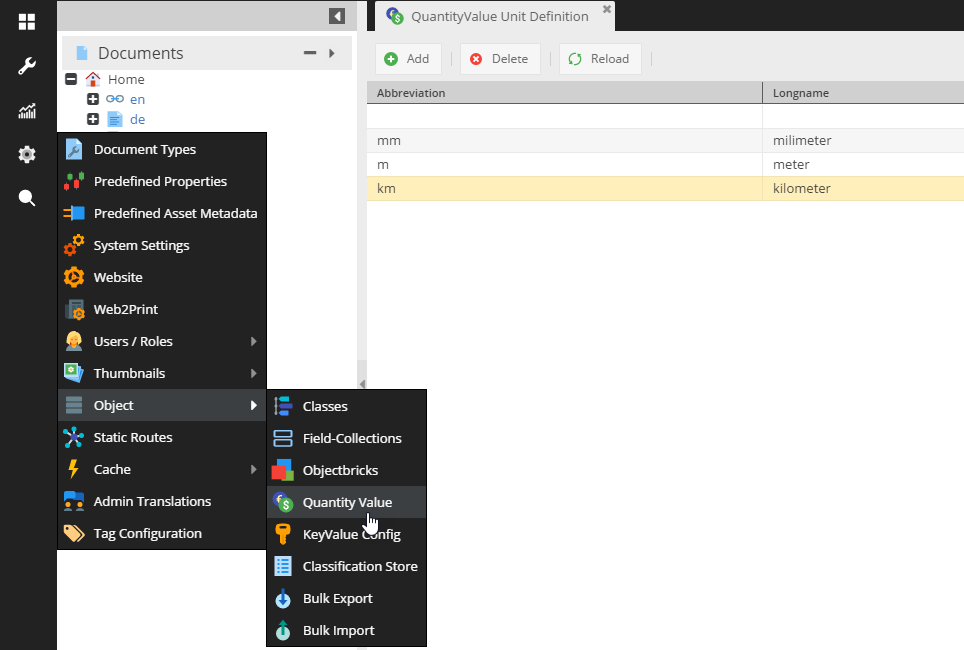
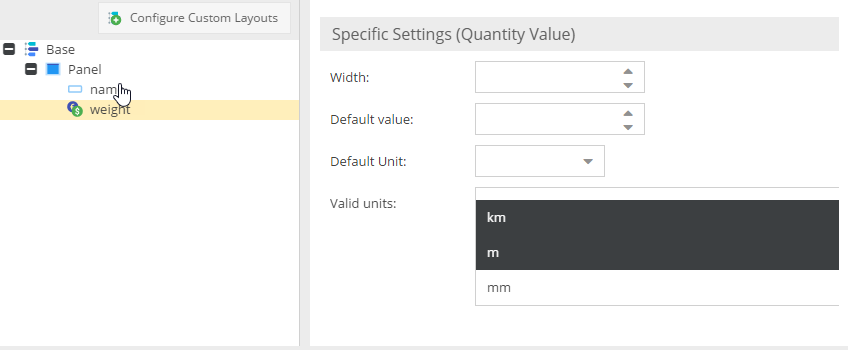
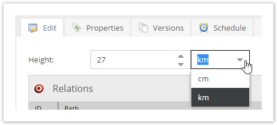

# Number Datatypes

Both numeric data types (`number` and `slider`) are stored as a number in a DOUBLE column in the database. 
To set numeric data, a number must be passed to the according setter. The two fields merely differ in their GUI input 
widgets and the fact that the slider has a min/max value and step size, which the numeric field does not have.


## Numeric


The numeric data field can be configured with a default value. In the GUI it is represented by a spinner field.


## Slider

In the GUI a slider can be used as a horizontal or vertical widget. It needs to be configured with a min and max value,
the increment step and decimal precision.


## Quantity Value

This is a numeric datatype that also allows to specify a unit.

Start off with defining a global list of known units.



This can also be achieved programmatically.

```php 
$unit = new Pimcore\Model\Object\QuantityValue\Unit();
$unit->setAbbreviation("km");   // mandatory
$unit->setLongname("kilometers");
$unit->setGroup("dimension");
$unit->save();
```


In the class editor, it is possible to restrict the list of valid units on a field-level.



Only those units will be available then.



The following code snippet shows how to set a value.
```php
use Pimcore\Model\Object;
  
$parent = Object::getByPath("/");
 
$object = new Object\Test();
$unit = Object\QuantityValue\Unit::getByAbbreviation("km");
$object->setKey("test2");
$object->setParent($parent);
$object->setHeight(new Object\Data\QuantityValue(27, $unit->getId()));
$object->save();
```
