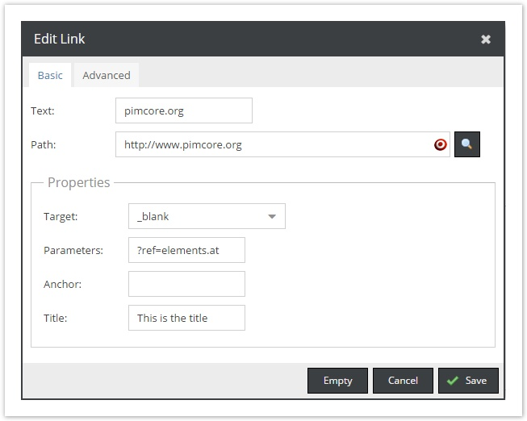

# Other Datatypes

## Checkbox


A checkbox field can be configured to be checked by default when a new object is created. This can be achieved by 
checking `Default value` in the object field settings. In the UI a checkbox is displayed as a simple checkbox. 

It is stored in a TINYINT column in the database with the value 0 or 1. 

In order to set a checkbox value, a bool value needs to be passed to the according setter of the object:

```php
$object->setCheckbox(true);
```

## Link 



In the UI a link is displayed as text. Its details can be edited by clicking on the button next to the link text. In the 
object class definition there are no special configurations available for an object field link.

The link object field has its own data class which is `Pimcore\Model\Object\Data\Link`. In order to set a link 
programmatically an `Pimcore\Model\Object\Data\Link` object needs to be instantiated and passed to the setter:

```php
$l = new Object\Data\Link();               
$l->setPath("http://www.pimcore.org");    
$l->setText("pimcore.org");            
$l->setTitle("Visit pimcore.org");               
$object->setLink($l);
```

In the database the link is stored in a TEXT column which holds the serialized data of an ```Pimcore\Model\Object\Data\Link```.

In the frontend (template) you can use the following code to the the html for the link. 

```php
<?php
$object = Object::getById(234);
?>
 
<ul>
  <li><?= $object->getMyLink()->getHtml(); ?></li>
</ul>
```

