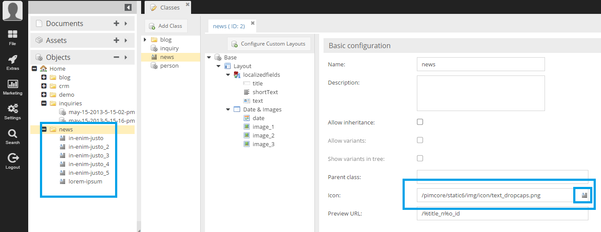
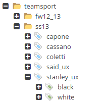
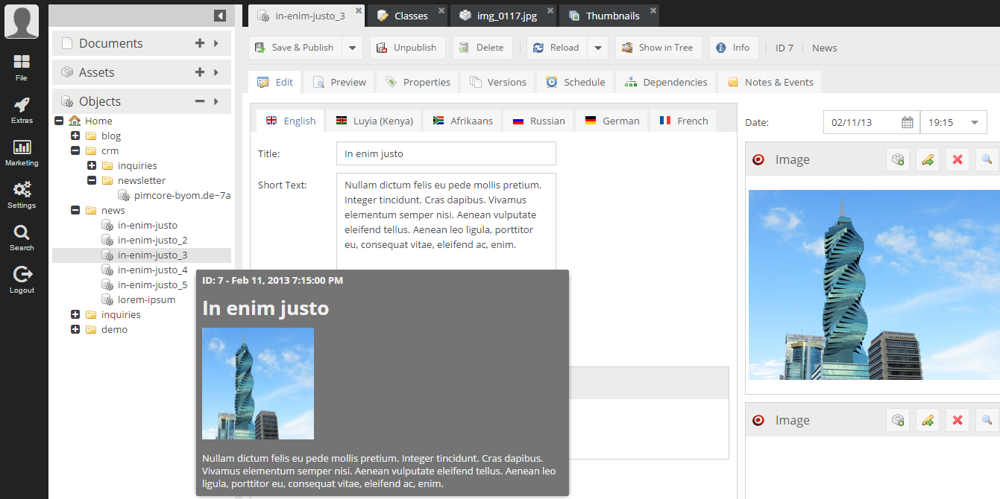

# Custom Icons for Objects

Pimcore allows to define custom icons for objects. Either, icons can be the same for all objects of a class 
(via configuration in class) or objects depending on their data values can have different icons (via admin style in code). 
In addition to that, the tooltip of an object in object tree can be customized via admin style.   

## Custom Icons for Classes

Objects can be displayed in Pimcore with custom icons. This makes objects distinguish themselves visually based on the 
class they are based on.
In the object tree the user can see on the first sight what an object should represent. The example below shows how 
custom icons are assigned to a class and how they are displayed in the object tree. It is easy for the user to see 
immediately which objects are of the type "football".



Icons that come along with Pimcore by default can be found in `http://your-domain/pimcore/static6/html/icons.php`.

#### Icon Sizes
As icons SVG graphics are recommended. If you use pixel graphics, maximum size is 18x20 pixels. 


## Custom Icons and Style in Object-Tree

It is possible to define custom icons and styles for objects in the object tree. 
In order to do so, overwrite the method `getElementAdminStyle` of `AbstractObject` by [extending the Pimcore 
 default class](./01_Inheritance.md) and return your own implementation of Element_AdminStyle.
 
#### Possible Properties to define:
* Element CSS class
* Element icon
* Element icon class

##### Extend the Object Class and Overwrite `getElementAdminStyle()`:
```php
public function getElementAdminStyle() {
   if (!$this->o_elementAdminStyle) {
      $this->o_elementAdminStyle = new Website_OnlineShop_AdminStyle($this);
   }
return $this->o_elementAdminStyle;
}
```

##### Custom Implementation of `Element_AdminStyle`
```php
class Website_OnlineShop_AdminStyle extends Element_AdminStyle {
 
    public function __construct($element) {
        parent::__construct($element);
 
        if($element instanceof Website_OnlineShop_Product) {
            if($element->getProductType() == "concrete") {
                $this->elementIcon = '/pimcore/static/img/icon/tag_green.png';
                $this->elementIconClass = null;
            } else if($element->getProductType() == "family") {
                $this->elementIcon = '/pimcore/static/img/icon/tag_yellow.png';
                $this->elementIconClass = null;
            } else if($element->getProductType() == "virtual") {
                $this->elementIcon = '/pimcore/static/img/icon/tag_blue.png';
                $this->elementIconClass = null;
            }
 
        }
    }
 
}
```

##### Example Result



### Custom Tooltips (ExtJS 6 only)

It is possible to define custom tooltips which are shown while hovering over the object tree.



The procedure is the same as for the icons. Code sample:
```php
public function getElementQtipConfig() {
    if ($this->element instanceof \Pimcore\Model\Object\News) {
        $thumbnail = $this->element->getImage_1()->getThumbnail("exampleResize");
        return [
            "title" => "ID: " . $this->element->getId() . " - " . $this->element->getDate(),
            "text" => '<h1>' . $this->element->getTitle() . '</h1>'
                . '<p></p> ' . $this->element->getShortText()
        ];
    }
    return parent::getElementQtipConfig();
```
